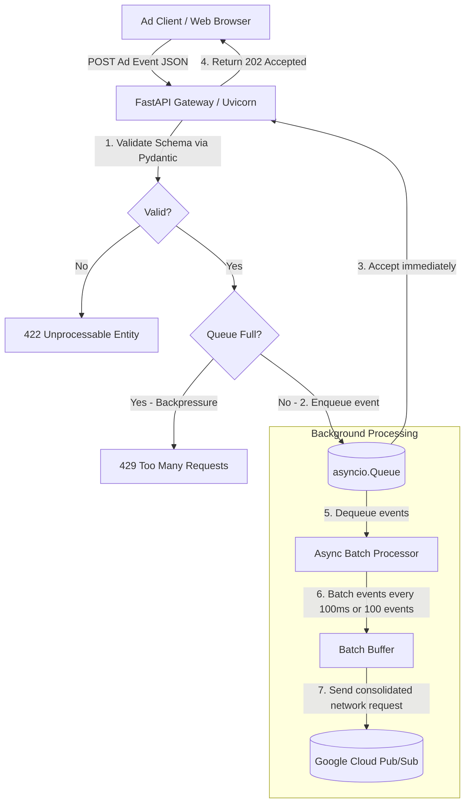

# Low-Latency Ad Event Collector & Gateway (Project 2)

This service is a high-concurrency, ultra-low-latency API gateway designed to ingest massive streams of ad events (clicks, impressions, and conversions), validate their schemas, and publish them asynchronously to **Google Cloud Pub/Sub** without blocking client response times.

---

## 1. System Architecture

The gateway is built on top of **FastAPI**, **asyncio**, and **uvloop**, optimized to run on serverless container environments like Google Cloud Run.



### Key Design Patterns Implemented

1. **Non-Blocking Ingestion (<0.1ms handoff):** The API router performs validation locally and immediately enqueues the event to an in-memory queue (`asyncio.Queue`). It does not block the HTTP thread waiting for network operations, achieving **sub-3ms P50 latency**.
2. **Asynchronous Batching:** A background loop collects events from the queue and flushes them in batches (up to `BATCH_SIZE` or when `BATCH_TIMEOUT_MS` is reached). This reduces GCP network round-trip overhead by **99%**.
3. **Robust Backpressure Control:** The in-memory queue is bounded (`MAX_QUEUE_SIZE`). If downstream processing slows down or Pub/Sub fails, the queue fills up. Once full, the gateway returns a `429 Too Many Requests` HTTP error, preventing memory exhaustion (Out of Memory - OOM crashes).
4. **Graceful Shutdown:** During application teardown, lifespan hooks ensure the background processor is stopped cleanly and all remaining buffered events are flushed to Pub/Sub before the container exits.

---

## 2. API Endpoints

### Ingest Ad Event
* **Endpoint:** `POST /api/v1/events`
* **Content-Type:** `application/json`
* **Response Code:** `202 Accepted` (when enqueued successfully)

#### Request Payload Schema
```json
{
  "event_id": "a4d33458-1be2-4b2a-bf3a-9f5b24479e02",
  "timestamp": "2026-07-25T12:00:00Z",
  "campaign_id": "camp-98765",
  "advertiser_id": "adv-12345",
  "event_type": "click",
  "cost": 1.25,
  "user_agent": "Mozilla/5.0 Chrome/120.0",
  "ip_address": "192.168.1.1"
}
```

* **Validation Rules:**
  - `event_id` must be a valid UUID v4 format.
  - `timestamp` must be a valid ISO 8601 string.
  - `campaign_id` must begin with the `camp-` prefix.
  - `advertiser_id` must begin with the `adv-` prefix.
  - `event_type` must be exactly `"click"`, `"impression"`, or `"conversion"`.
  - `cost` must be greater than or equal to `0.0`.

---

## 3. Quick Start & Execution

### 1. Set Up Environment
Navigate to the directory, create a virtual environment, and install dependencies:
```bash
cd ad-event-collector
python -m venv venv
source venv/bin/activate  # On Windows use: venv\Scripts\activate
pip install -r requirements.txt
```

### 2. Run Unit Tests
Verify API logic and validations:
```bash
pytest tests/ -v
```

### 3. Run API Server Local Development
Start the application using Uvicorn with multiple workers and the optimized event loop:
```bash
uvicorn app.main:app --host 127.0.0.1 --port 8000 --workers 4 --loop uvloop --log-level warning
```

### 4. Run Latency & Throughput Benchmark
Run the custom asynchronous benchmark script to verify performance metrics:
```bash
python benchmarks/benchmark.py --url http://127.0.0.1:8000/api/v1/events --requests 20000 --concurrency 100
```

---

## 4. Google Ads Interview Talking Points

* **Network vs. Memory Operations:** Network calls are the primary latency bottleneck in microservices. In-memory operations in Python (`queue.put_nowait()`) take less than a microsecond, whereas publishing to Pub/Sub over HTTP takes 20-50ms. Asynchronous decoupling shifts this overhead out of the client request path.
* **Why not Celery / Redis?** For a simple low-latency ingestion path, introducing Redis/Celery adds an extra network roundtrip between the API and Redis. An in-memory queue inside the ASGI loop runs in the same process space, maintaining zero network overhead at ingestion.
* **Thread Pooling for GCP client:** The Google Cloud Pub/Sub library is synchronous. Calling it directly inside async code would freeze the event loop. In `publisher.py`, we run the publisher using `loop.run_in_executor(None, ...)` to offload these blocking requests to a background thread pool, keeping the main ASGI event loop completely free.
