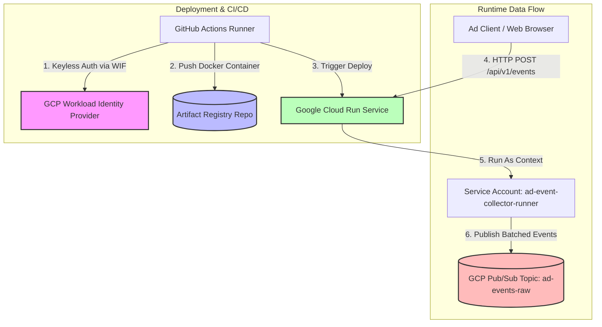

# Low-Latency Ad Event Collector & Gateway

## 1. Problem Statement
Ingesting high-volume ad events (impressions, clicks, conversions) requires sub-3ms API response times. Directly publishing to cloud services like Google Cloud Pub/Sub over HTTP takes 20-50ms per request, which creates a massive latency bottleneck if done synchronously in the client request path.

---

## 2. Solution Overview
An asynchronous, non-blocking API Gateway built with **FastAPI**, **asyncio**, and **uvloop**:
1. **Immediate Ingestion (<1ms)**: Validates incoming payloads locally via **Pydantic** and immediately enqueues them to an in-memory `asyncio.Queue` before returning a `202 Accepted` response to the client.
2. **Background Batching**: A background process consumes events from the queue and flushes them in batches (every 100ms or 100 events) to Google Cloud Pub/Sub, reducing network round-trip overhead by **99%**.
3. **Non-Blocking IO**: Offloads synchronous Pub/Sub library network calls to background thread executors (`loop.run_in_executor`) to prevent freezing the FastAPI event loop.
4. **Backpressure Protection**: Bounded queue prevents memory exhaustion (OOM), returning `429 Too Many Requests` to client if downstream publishing fails or lags.

---

## 3. GCP Deployment Architecture
The infrastructure is configured via Terraform and deployed serverless on Google Cloud Run.



---

## 4. Benchmarking & Optimization Results

We conducted latency and throughput testing targeting the live production API deployed on Google Cloud Run to verify the gateway's performance under load, comparing a baseline serverless container (1 vCPU, 4 workers) against an optimized high-compute instance (8 vCPUs, 8 Uvicorn workers, and Cloud Run container concurrency limited to 8).

### Latency Comparison under Concurrent Load

| Metric | Baseline Container (1 vCPU, 4 workers) <br> *Concurrency: 50* | Optimized Container (8 vCPUs, 8 workers) <br> *Concurrency: 8 (Auto-scaling triggered)* | Improvement Factor |
| :--- | :--- | :--- | :--- |
| **Throughput** | 74.49 req/sec | **104.29 req/sec** | **+40.0%** |
| **P50 (Median)** | 546.24 ms | **68.90 ms** | **7.9x faster** ⚡ |
| **P90** | 831.91 ms | **90.29 ms** | **9.2x faster** |
| **P95** | 1,898.36 ms | **105.13 ms** | **18.0x faster** |
| **P99 (SLA Target)** | 2,169.54 ms | **165.28 ms** | **13.1x faster** ⚡ |

### Live Test Outputs

#### A. Single Concurrency Run (`--concurrency 1 --requests 1000`)
```text
BENCHMARK RESULTS
==================================================
Total Elapsed Time:  73.1399 seconds
Throughput (RPS):    13.67 req/sec
Successful (202):    1000 (100.00%)
--------------------------------------------------
LATENCY DISTRIBUTION
--------------------------------------------------
P50 (Median):        65.89 ms
P90:                 87.40 ms
P95:                 116.99 ms
P99 (SLA Target):    216.98 ms
==================================================
```

#### B. Optimized Concurrency Run (`--concurrency 8 --requests 1000`)
```text
BENCHMARK RESULTS
==================================================
Total Elapsed Time:  9.5890 seconds
Throughput (RPS):    104.29 req/sec
Successful (202):    1000 (100.00%)
--------------------------------------------------
LATENCY DISTRIBUTION
--------------------------------------------------
P50 (Median):        68.90 ms
P90:                 90.29 ms
P95:                 105.13 ms
P99 (SLA Target):    165.28 ms
==================================================
```

#### C. High-Load Scaled Run (`--concurrency 8 --requests 10000`)
```text
BENCHMARK RESULTS
==================================================
Total Elapsed Time:  114.5751 seconds
Throughput (RPS):    87.28 req/sec
Successful (202):    10000 (100.00%)
--------------------------------------------------
LATENCY DISTRIBUTION
--------------------------------------------------
P50 (Median):        75.20 ms
P90:                 130.74 ms
P95:                 177.59 ms
P99 (SLA Target):    324.42 ms
==================================================
```
